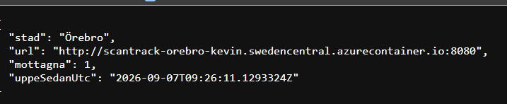
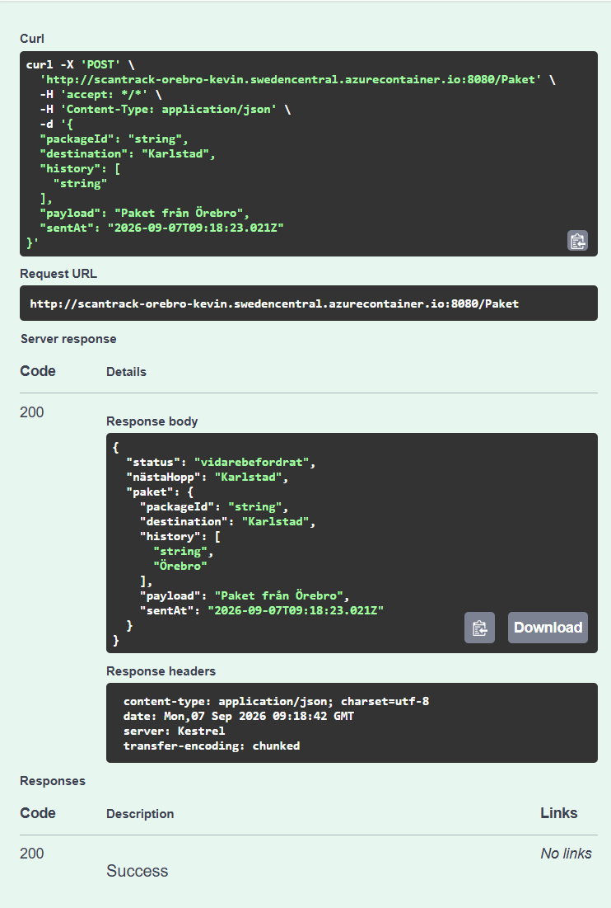
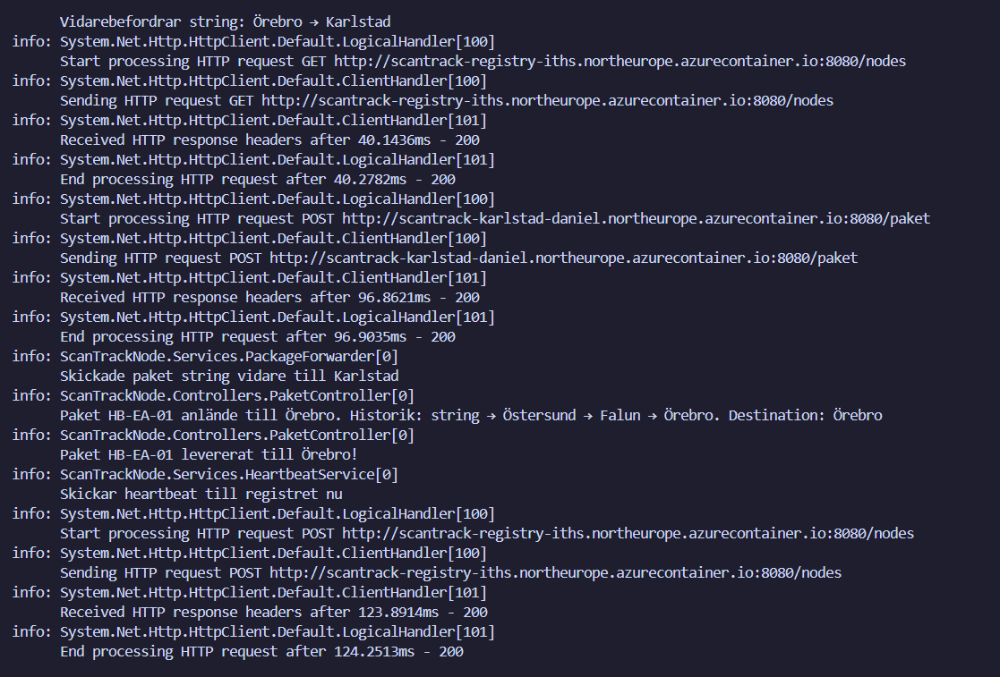

# Rapport — ScanTrack AB: Containerisera och deploya din nod

**Grupp:**  
**Deltagare:** Kevin Hermansson  
**Datum:** 2026-09-07  
**Namn:** Kevin Hermansson  

---

## 1. Arkitektur

Jag byggde min nod som en Docker-container med en multi-stage Dockerfile.

Flödet såg ungefär ut så här:

```text
Dockerfile → docker build → ACR push → ACI deploy → publik DNS-adress
```

Först körde och testade jag applikationen lokalt.

Efter det byggde jag Docker-imagen och pushade den till Azure Container Registry.

Sedan deployade jag imagen till Azure Container Instances.

Min nod kör staden **Örebro**.

Den publika adressen till noden är:

`http://scantrack-orebro-kevin.swedencentral.azurecontainer.io:8080`

Swagger finns på:

`http://scantrack-orebro-kevin.swedencentral.azurecontainer.io:8080/swagger`

---

## 2. NODE_URL-problemet

Problemet med `NODE_URL` var att containern behövde veta sin egen publika adress.

Samtidigt får man inte den publika adressen förrän containern faktiskt är skapad i Azure.

Det blir alltså lite av ett cirkelproblem.

Jag löste det genom att använda ett fast DNS-namn i Azure Container Instances.

Jag använde:

`scantrack-orebro-kevin.swedencentral.azurecontainer.io`

Då kunde jag sätta `NODE_URL` till:

`http://scantrack-orebro-kevin.swedencentral.azurecontainer.io:8080`

På så sätt kan samma adress användas igen även om containern behöver tas bort och skapas om, så länge jag använder samma DNS-namn.

---

## 3. Bevis

### GET /status från Örebro-noden

Bilden nedan visar att Örebro-noden är igång.

Man kan se att:

- staden är Örebro
- rätt URL används
- noden är uppe
- `uppeSedanUtc` visas



### Skicka paket via Swagger

Jag testade även att skicka ett paket via Swagger genom endpointen:

`POST /Paket`

Jag skickade paketet mot destination **Karlstad**.

Svaret blev:

`200 Success`

I svaret syns bland annat:

- `status`: `vidarebefordrat`
- `nästaHopp`: `Karlstad`
- `history`: innehåller `Örebro`
- `payload`: `Paket från Örebro`

Det visar att Örebro-noden kan ta emot ett paket och skicka det vidare till nästa nod.



### Loggar från Azure Container Instances

Jag hämtade även loggarna från containern med Azure CLI.

I loggarna syns bland annat:

- `Vidarebefordrar string: Örebro → Karlstad`
- att ett POST-anrop skickas till Karlstad
- att svaret blir `200`
- `Skickade paket string vidare till Karlstad`

Det syns också att ett annat paket kommer fram till Örebro och levereras där.



---

## 4. Ansvarsområden

Jag ansvarade för min egen nod som var **Örebro**.

Det jag gjorde var bland annat:

- jobbade med Dockerfile
- byggde Docker-imagen
- pushade imagen till Azure Container Registry
- deployade containern till Azure Container Instances
- satte upp DNS-namn och `NODE_URL`
- testade `GET /status`
- testade `POST /Paket`
- kollade loggar i Azure för att se att paketet faktiskt gick vidare

---

## Individuell reflektion

### Vad var svårast?

Det svåraste var nog `NODE_URL`-problemet.

Jag förstod inte direkt hur containern skulle kunna veta sin egen publika adress när adressen inte finns förrän containern redan är skapad.

Det tog lite tid innan jag förstod att man kunde använda ett fast DNS-namn istället.

### Vad förstår du nu som du inte förstod innan?

Jag förstår bättre hur Docker, Azure Container Registry och Azure Container Instances hänger ihop.

Jag har också bättre koll på hur man bygger en image, pushar den till ACR och sedan använder den för att starta en container i Azure.

Jag förstår även bättre hur miljövariabler som `NODE_URL` används i en container.

### Vad skulle du ha gjort annorlunda?

Jag hade nog försökt planera DNS-namnet och `NODE_URL` tidigare.

Jag testade en del olika saker innan jag fick ordning på det.

Om jag hade förstått DNS-delen direkt hade deploymenten gått snabbare.

### Hur planerades projektet?

Projektet delades upp så att varje person kunde jobba med sin egen nod.

Jag jobbade med Örebro och fokuserade först på att få applikationen att fungera lokalt.

Efter det tog jag Docker, ACR och ACI steg för steg.

Till sist testade jag status-endpointen, skickade paket och kontrollerade loggarna.

### Hur fungerade samarbetet?

Samarbetet fungerade bra.

Eftersom vi hade olika noder kunde man jobba ganska mycket självständigt men ändå behövde noderna fungera ihop.

Det gjorde också att vi kunde testa att paket faktiskt skickades vidare mellan olika noder.
